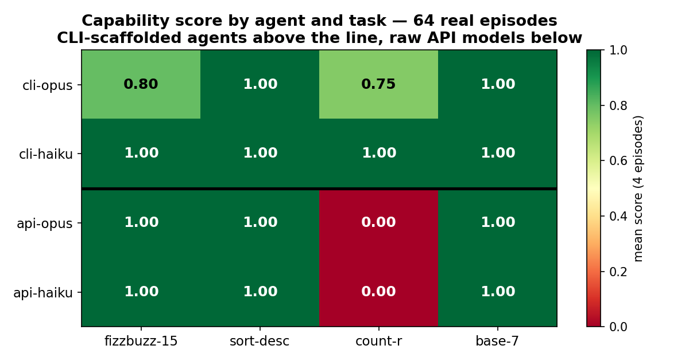
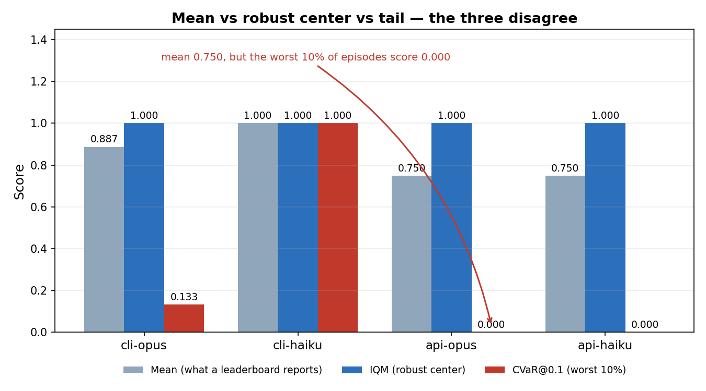
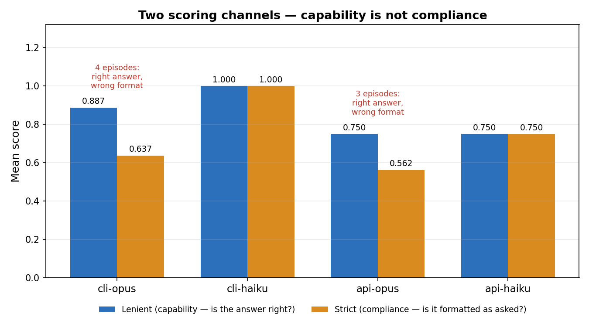
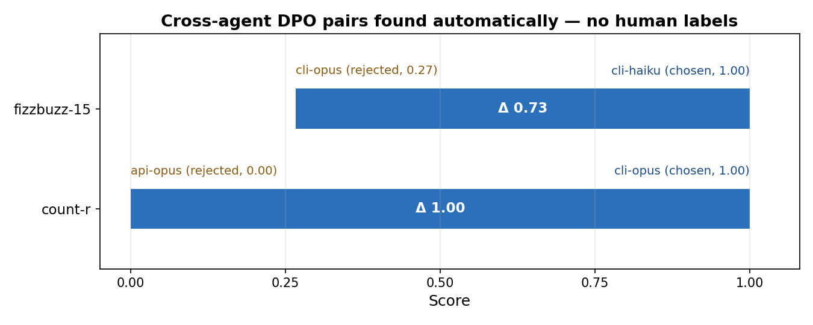
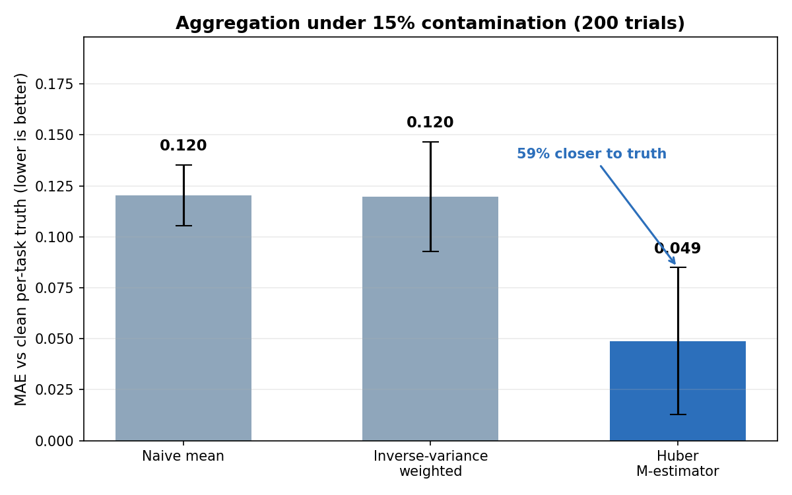
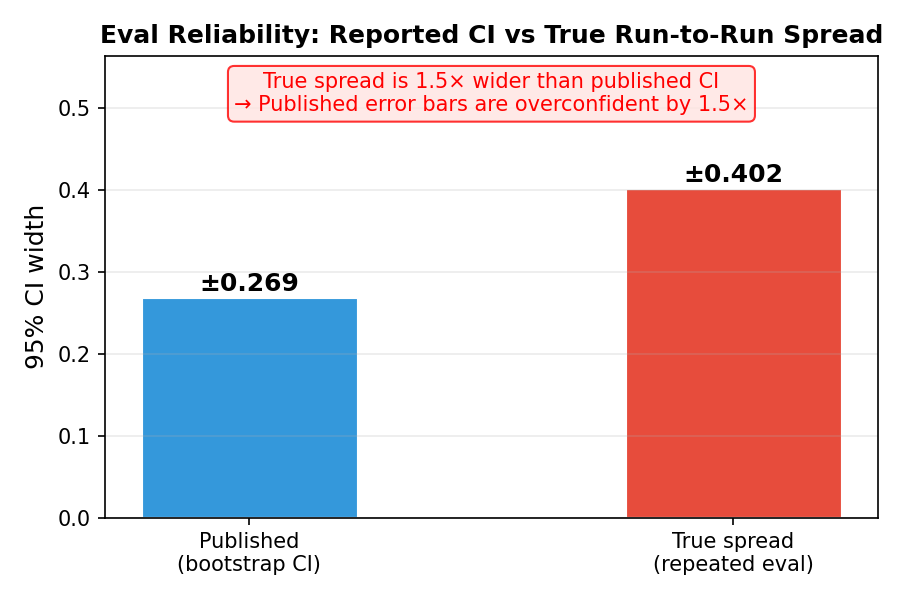

# disteval

**Distribution-first evaluation and self-improvement for long-horizon AI agents.**

disteval does two things that no other eval framework does together:

1. **Measures the full outcome distribution** of agent runs — not just the mean,
   but tail risk, consistency, stochastic dominance, and multi-run confidence
   intervals that expose whether a reported improvement is real or eval noise.
2. **Automatically generates training data** from those runs — no human labels,
   no synthetic data. If an agent sometimes solves a task and sometimes fails,
   those two trajectories are a ready-made DPO training pair.

Three design principles drive every decision:

- **Rigorous multi-run evaluation**: running an agent 8× on each task (standard
  practice) is worthless if you only report the mean. disteval reports CIs,
  per-run repeatability, and whether a two-point gap is within eval noise.
- **Criterion-level failure analysis**: aggregate pass/fail per rubric criterion
  across all episodes to surface *which specific requirement* an agent fails
  most — actionable at the task-design and training level.
- **Data efficiency**: the DPO curriculum disteval generates is proof that
  hundreds (not tens of thousands) of targeted trajectory pairs produce
  measurable capability gain — because they come from the exact tasks where
  the agent's knowledge is incomplete, not from random sampling.

---

## The problem in one picture

```
Harbor leaderboard:          disteval adds:

Claude Code  0.836 ████████  Mean    IQM    CVaR@0.1   pass^3
Gemini CLI   0.754 ███████   0.836   0.970   0.500     0.600   ← reliable
Codex CLI    0.300 ███       0.754   0.955   0.000 ←!  0.400   ← tail collapses
                             0.300   0.067   0.000     0.167   ← flaky
```

Gemini's CVaR@0.1 = 0.000 on easy tasks. Harbor's mean showed nothing about
this. And for Gemini's inconsistent tasks, disteval has found the DPO pairs —
the passing run and the failing run are already in `jobs/`.

---

## Install

```bash
pip install disteval
```

Requirements: Python ≥ 3.10, numpy, pandas, scipy, matplotlib.

Optional: `pip install disteval[inspect]` for Inspect (UK AISI) log support,
`pip install disteval[rliable]` for rliable matrix export.

---

## Quickstart: 5-minute loop from eval to training curriculum

```bash
# 1. Run your agents on tasks with Harbor
harbor run --agents my-agent --tasks tasks/ --episodes 3

# 2. Get the full distribution report
disteval report jobs/run_1/ --agent my-agent --tasks-dir tasks/

# 3. Generate a ranked training curriculum with DPO pairs
disteval engine jobs/run_1/ --agent my-agent --tasks-dir tasks/ --output plan.json

# 4. Train on the pairs disteval found (see CURRICULUM_FORMAT.md)
#    your_dpo_trainer.py --curriculum plan.json

# 5. Re-run and watch consistency_index rise each cycle
harbor run --agents my-agent-v2 --tasks tasks/ --episodes 3
disteval engine jobs/run_2/ --agent my-agent-v2 --cycle 2 --output plan_2.json
```

---

## CLI commands

```bash
disteval report   jobs/<run>/               # single-agent distribution report + charts
disteval compare  jobs/run_A/ jobs/run_B/   # head-to-head leaderboard comparison
disteval engine   jobs/<run>/               # generate training curriculum
disteval sim      jobs/<run>/               # Monte Carlo training simulation
disteval train    --curriculum plan.json    # train a policy from a curriculum (DPO)
```

`disteval report` also accepts a generic `.jsonl`/`.json` records file directly
(see "Bring your own agent" below).

Or invoke by module: `python -m disteval <subcommand>`.

---

## How it works

### Step 1 — measure the distribution, not just the mean

Five metrics that harbor reports only one of:

| Metric | What it tells you | Harbor? |
|--------|-------------------|---------|
| **Mean** | Average score | ✓ |
| **IQM** | Mean with top/bottom 25% stripped — outlier-resistant | ✗ |
| **CVaR@0.1** | Expected score in worst 10% of runs — tail risk | ✗ |
| **pass@k** | P(≥1 success in k tries) — peak capability | ✗ |
| **pass^k** | P(all k tries succeed) — deployment consistency | ✗ |

A large gap between `pass@k` and `pass^k` is the signature of inconsistency.

```python
from disteval.adapters.harbor_jobs import load_harbor_job
from disteval import metrics

store = load_harbor_job("jobs/run_1/", tasks_dir="tasks/")
df = store.df()

metrics.iqm(df["score"].values)           # 0.955
metrics.cvar(df["score"].values, 0.1)     # 0.000 — tail collapses
metrics.pass_at_k(df, k=3)               # 0.889
metrics.pass_hat_k(df, k=3)              # 0.400 — only 40% fully consistent
```

**Statistical-rigor toolkit.** Beyond the headline aggregates, disteval ships
the primitives that keep multi-run comparisons honest:

- `metrics.reliability_decay` / `variance_amplification_factor` — the *shape* of
  the pass^k decay curve and how much long-horizon tasks amplify variance.
- `bootstrap.confidence_sequence` — anytime-valid CIs so you can add runs and
  stop early without p-hacking the stated coverage.
- `compare.adjust_pvalues` (Benjamini-Hochberg / Holm) — multiple-comparison
  correction for leaderboards and per-criterion failure tests.
- `compare.min_detectable_effect` / `required_n` — power analysis: is your
  "no significant difference" just an underpowered run?
- `compare.score_length_bias` — flags score↔length correlation, the classic
  reward-hacking signature, before you turn runs into DPO pairs.
- `metrics.grpo_advantages` — group-relative (GRPO-style) advantages over the
  multiple runs per task.
- `compare.bradley_terry` — joint MLE ranking of ≥3 systems from a pairwise win
  matrix, with bootstrap CIs and a ranking-instability flag (the Chatbot-Arena
  method), plus `compare.win_matrix_from_pairs`.
- `irt` — 2-parameter item response theory: fit per-task difficulty and
  discrimination and per-agent ability, then `irt.select_items` picks the most
  *informative* tasks so you can match a full-bank ability estimate with far
  fewer items (adaptive/efficient eval).
- `ppi` — prediction-powered inference: debias an LLM-judge score column using a
  small gold calibration set, with a tighter CI than gold labels alone.
- `bootstrap.betting_cs` — a variance-adaptive betting confidence sequence
  (Waudby-Smith & Ramdas), far tighter than the Hoeffding `confidence_sequence`
  in the near-0/near-1 pass-rate regime, still valid under continuous peeking.
- `shrinkage` — empirical-Bayes partial pooling for the few-runs-per-task regime:
  `empirical_bayes_passrate` (Beta-Binomial), positive-part `james_stein`, and
  `eb_credible_interval` — stabilizes noisy per-task estimates and curbs the
  winner's-curse when ranking many tasks.
- `evt` — extreme value theory for the risk tail: a peaks-over-threshold GPD fit
  (`fit_gpd_pot`) that *extrapolates* `evt_var`/`evt_cvar` beyond the observed
  runs (empirical CVaR@0.01 with 8 runs is just `min`), plus a Hill tail index
  for heavy unbounded metrics — all flagged `low_confidence` at small n and
  paired with `evt_bootstrap_ci`.
- `compare.conformal_interval` — distribution-free prediction interval for an
  agent's next-run score with finite-sample coverage (no parametric assumption).
- `compare.mmd_test` / `energy_distance` / `energy_test` — omnibus two-sample
  tests that catch *any* distributional difference (e.g. same-mean-different-
  variance), unlike KS/Mann-Whitney; work on joint (score, length, steps) too.
- `metrics.divergences` — TV / Hellinger / KL / χ² / Rényi between two agents'
  outcome distributions in one call.
- `best_arm` — pure-exploration bandits (`sequential_halving`,
  `successive_elimination`) that spend an eval budget adaptively to identify the
  best of K agents/configs, with fixed-budget or fixed-confidence guarantees.

**Self-improvement safeguards (opt-in).** The recursive `run_cycle`/`reload`
loop is a self-consuming training process, which can collapse. `SelfEngine` now
accepts `accumulate_trajectories=True` (keep past trajectories across cycles
rather than replacing them) and `diversity_threshold` (drop near-duplicate
reinforce trajectories so the loop doesn't narrow the output distribution).
`training_sim.overoptimized_gain` / `optimal_training_amount` model the
hump-shaped reward-overoptimization curve (gold reward rises, peaks, then
regresses) so a planner knows when to stop.

### Step 2 — classify every task as SOLID / RECOVERABLE / STUCK

For each task, disteval computes:

- **Q\*(t)** = best score across all runs (demonstrated capability)
- **Q̄(t)** = mean score (what standard RL optimizes)
- **Δ(t)** = Q\* − Q̄ (recoverable gap — score left on the table)
- **κ(t)** = Q̄ / Q\* (consistency index, 0–1)

| Class | Condition | What it means | Action |
|-------|-----------|---------------|--------|
| **SOLID** | Q\* > 0, Δ = 0 | Consistently achieves best | Skip — nothing to recover |
| **RECOVERABLE** | Q\* > 0, Δ > 0 | Can solve it but doesn't always | **Train here — DPO pair exists** |
| **STUCK** | Q\* = 0 | Never solved it | No pair possible — needs new capability |

```python
from disteval.right_tail import right_tail_analysis

report = right_tail_analysis(store, model_name="my-agent")
print(f"κ = {report.consistency_index:.2f}")       # 0.81
print(f"recoverable gap = {report.total_gap:.2f}") # 0.83 — score available to recover

for task in report.priority_tasks:   # sorted by Δ × (1 − κ), highest leverage first
    print(task.task, task.kind)
    print("  reinforce:", task.reinforce_idx)  # indices of passing runs
    print("  contrast:", task.contrast_idx)    # indices of failing runs
```

### Step 3 — generate the training curriculum

`SelfEngine` assembles the full pipeline in one call: reads trajectories, runs
right-tail analysis, finds the divergence step where the passing and failing
runs first diverge, queries trajectory memory for similar past successes, ranks
tasks by **Δ(t) × (1 − κ(t))**, and writes a JSON curriculum with file paths
ready to feed into DPO training.

```python
from disteval.self_engine import SelfEngine

engine = SelfEngine.from_job_dirs(
    ["jobs/run_1/"],
    agent_name="my-agent",
    model_name="my-model",
    tasks_dir="tasks/",
)
plan = engine.run_cycle(cycle=1)

print(plan.summary())
# Cycle 1 | 6 tasks: 2 SOLID · 3 RECOVERABLE · 1 STUCK
# consistency_index κ = 0.81 | recoverable_score_left = 0.83
# predicted_gain = +0.12

plan.save("plan.json")
```

The output `plan.json` contains the ranked curriculum with `reinforce_traj_path`
and `contrast_traj_path` for each RECOVERABLE task.
See [CURRICULUM_FORMAT.md](CURRICULUM_FORMAT.md) for the full spec.

---

## Mathematical foundations

disteval's choices are not ad-hoc heuristics. Each primitive is backed by a
specific statistical or decision-theoretic model.

### Distribution metrics

For a task with scores `x_1, ..., x_n`:

- **IQM** (interquartile mean): mean after removing the lowest and highest 25%.
  Robust to outliers while retaining more data than the median.
- **CVaR@α** (conditional value at risk): average of the worst `α` fraction of
  outcomes. In disteval, `α = 0.1` measures tail risk — how bad the agent can
  get on a bad run.
- **pass^k**: probability that all `k` independent runs succeed. This is the
  deployment-relevant consistency metric.

### Right-tail taxonomy

For each task `t`:

```
Q*(t) = max_i score_i(t)        # demonstrated capability
Q̄(t) = mean_i score_i(t)         # what standard RL optimizes
Δ(t) = Q*(t) - Q̄(t)              # recoverable gap
κ(t) = Q̄(t) / Q*(t)              # consistency index (0-1)
```

A task is **RECOVERABLE** when `Q*(t) > 0` and `Δ(t) > 0`. The training pair
is automatically `(reinforce, contrast) = (argmax_i score_i(t), argmin_i score_i(t))`.

### Curriculum ranking

The default heuristic ranks by leverage:

```
priority(t) = Δ(t) · (1 - κ(t))
```

An information-theoretic alternative is also available:

```
priority_eig(t) = H[score(t)] · (1 - κ(t))
```

where `H[score(t)]` is the empirical Shannon entropy of the per-task score
distribution. It prioritizes tasks whose outcomes are both uncertain and
recoverable.

### Optimal control formulation

Curriculum scheduling can be modeled as a finite-horizon MDP with state
` s = (κ_1, ..., κ_n, t) `, action `a ∈ {1, ..., n, STOP}`, deterministic
transition

```
κ_i' = min(1, κ_i + α · Δ(i) · (1 - κ_i))
```

and reward `R(s, a=i) = α · Δ(i) · (1 - κ_i)`. The Bellman optimality equation
is

```
V*(s) = max_a [ R(s, a) + γ · V*(s') ]
```

`disteval.curriculum_optimizer` provides value iteration and rolling-horizon MPC
solvers for this MDP.

### Bayesian optimization

Training hyperparameters such as the DPO learning rate `α` and the right-tail
bonus `β` are tuned via Gaussian Process Bayesian optimization. The surrogate
models the objective `f(x) = mean_score_after_training(x)` and the acquisition
function balances posterior mean (exploitation) and posterior variance
(exploration). `disteval.bayesian_optimization.optimize_dpo_hyperparameters`
exposes this for `(α, β, k)`.

### Robust distributed aggregation

When multiple agents evaluate the same task with different reliability, the
minimum-variance unbiased aggregate is the inverse-variance weighted mean:

```
μ̂_t = Σ_i w_i · x_i / Σ_i w_i,    w_i = 1 / σ_i²
```

For outlier agents, `aggregate_by_task_robust` uses M-estimation (Huber loss)
via iterative reweighted least squares. Consensus boundaries use confidence-
weighted medians instead of plain medians.

### Thompson Sampling for online task selection

`disteval.bayesian_optimization.ThompsonSamplingScheduler` maintains a Gaussian
posterior over feature weights `θ` and samples `θ̃ ~ N(μ, Σ)` at each cycle to
select the task with highest predicted reward `x_i^T θ̃`. This is a contextual
bandit with linear payoffs (LinTS; Agrawal & Goyal 2013) and provides
principled exploration-exploitation trade-offs.

---

## Bring your own agent — no Harbor required

disteval works with any agent that produces a score per attempt and a trajectory
file. Use the generic adapter:

```python
# your_eval.py
import json
from disteval.adapters.generic import load_records

# Build a JSONL file from your eval results:
results = []
for task in tasks:
    for attempt in range(3):
        score, traj_path = run_my_agent(task, attempt)
        results.append({
            "run_id": "run_001",
            "model": "my-agent",
            "task": task,
            "episode": attempt,
            "score": score,
            "difficulty": task_difficulty[task],   # optional
            "trajectory": traj_path,               # optional but needed for DPO pairs
        })

with open("runs.jsonl", "w") as f:
    for r in results:
        f.write(json.dumps(r) + "\n")

# Load into disteval:
store = load_records("runs.jsonl")
```

Then run the report CLI directly on the file:

```bash
disteval report runs.jsonl --agent my-agent
```

> The distribution **report** works from a flat records file. The **engine**
> curriculum step additionally needs per-step trajectory files (for structural
> divergence localization), so point it at Harbor-style job directories rather
> than a flat `.jsonl`.

See [TRAJECTORY_FORMAT.md](TRAJECTORY_FORMAT.md) for the full record and
trajectory file specifications.

---

## Supported eval frameworks

| Framework | How to load |
|-----------|-------------|
| [Harbor](https://github.com/av/harbor) | `disteval.adapters.harbor_jobs.load_harbor_job` |
| [Inspect](https://inspect.ai) (UK AISI) | `disteval.adapters.inspect_log.load_inspect_json` |
| [rliable](https://github.com/google-research/rliable) | `disteval.adapters.rliable_bridge.to_rliable_dict` |
| Any custom eval | `disteval.adapters.generic.load_records` (JSONL) |

---

## Advanced features

### Real-time trajectory monitoring

The structural signature of an agent's tool-call sequence predicts final outcome
with **89% leave-one-out accuracy** before the run completes.

```python
from disteval.trajectory_monitor import TrajectoryMonitor

monitor = TrajectoryMonitor.from_job_dirs(["jobs/run_1/"])

# Check after each agent step:
match = monitor.check(current_steps, prefix_n=len(current_steps))
print(match.prediction)    # "high" | "low" | "uncertain"
print(match.p_high)        # 0.07 — heading for failure
print(match.warning)       # "Searching extensively without writing code..."
print(match.recommendation)# "Stop searching. Write a minimal implementation now."
```

### Cross-session trajectory memory

Retrieve the trajectories where the agent succeeded on tasks it normally fails
— before starting a new run.

```python
from disteval.trajectory_memory import TrajectoryMemory

mem = TrajectoryMemory()
mem.load_from_job_dirs(["jobs/run_1/", "jobs/run_2/"])

results = mem.retrieve_for_new_task("log file parser python", k=3)
prompt  = mem.generate_retrieval_prompt(results, context="before_task")
# Feed prompt to agent before it starts the task
```

### Distribution comparison between agents

```python
from disteval import compare

a = store_A.df()["score"].values
b = store_B.df()["score"].values

compare.wasserstein(a, b)             # 0.082
compare.prob_improvement(a, b)        # 0.546 — P(A > B)
compare.stochastic_dominance(a, b)    # {"FSD_A_dominates_B": True, ...}
```

### Criterion-level failure analysis (rubric grading)

Real evaluation rubrics score agents against multiple pass/fail criteria. Two
agents with identical aggregate success rates can fail on entirely different
requirements. `criterion_failure_rates` pinpoints which rubric items are broken:

```python
from disteval.failure import criterion_failure_rates, top_failing_criteria

# episodes: list of dicts, each with a "criteria" key mapping criterion → bool
episodes = [
    {"criteria": {"output_format": True, "cost_within_budget": False, "no_data_loss": True}, "difficulty": "hard"},
    {"criteria": {"output_format": False, "cost_within_budget": False, "no_data_loss": True}, "difficulty": "hard"},
    {"criteria": {"output_format": True,  "cost_within_budget": True,  "no_data_loss": True}, "difficulty": "easy"},
]

df = criterion_failure_rates(episodes)
# Returns: criterion | n_episodes | n_failed | failure_rate (sorted by failure_rate desc)
# → cost_within_budget: 2/3 failed (0.667) — most actionable rubric weakness

top3 = top_failing_criteria(episodes, n=3, by=["difficulty"])
# Stratified: which criteria fail most on "hard" vs "easy" tasks?
```

### Multi-run evaluation reliability

A standard single-run bootstrap CI is a *lower bound* on true run-to-run
variance — it can't capture env seed variance or LLM nondeterminism across
runs. `repeat.py` measures the actual meta-distribution:

```python
from disteval.repeat import meta_distribution, bootstrap_vs_repeat, is_gap_real

# Run your eval n times, collect a list of RecordStores
stores = [run_eval(seed=i) for i in range(8)]

meta = meta_distribution(stores, stat_fn=lambda df: df["score"].mean())
print(meta["ci_width"])    # true run-to-run CI width

diag = bootstrap_vs_repeat(stores, stat_fn=lambda df: df["score"].mean())
print(diag["underconfidence_ratio"])
# If >> 1, your single-run bootstrap CI is overconfident — the reported
# error bars are too tight and a 2-point improvement may be noise.

verdict = is_gap_real(stores_A, stores_B, stat_fn=lambda df: df["score"].mean())
print(verdict["P(A>B on a fresh re-run)"])   # decision-relevant probability
```

### Agent harness for running and recording episodes

If you want disteval to capture the agent lifecycle itself instead of only
reading logs from Harbor or Inspect, use the harness:

```python
from disteval.agent_harness import AgentHarness, Agent, TaskSpec

class MyAgent(Agent):
    def run_step(self, context):
        # ... call LLM, return tool calls ...
        return Step(tool_calls=[ToolCall("read_file", {"file_path": "task.md"})])

harness = AgentHarness(
    agent=MyAgent(),
    executor=MyToolExecutor(),
    verifier=MyVerifier(),
    agent_name="my-agent",
)

result = harness.run_episode(TaskSpec(id="task-1", instruction="..."), output_dir="runs/")
result.store.to_jsonl("runs/records.jsonl")
```

The harness manages the agent lifecycle (intent, tool execution, memory,
verification, and persistence) and writes records and trajectories in the
exact format the rest of disteval consumes. See
[`research/agent_harness.md`](research/agent_harness.md) for the design mapping.

---

## File layout

```
disteval/
  __main__.py             — unified CLI dispatcher (disteval <subcommand>)
  records.py              — EpisodeRecord, RecordStore
  metrics.py              — IQM, CVaR, VaR, pass@k, pass^k
  bootstrap.py            — stratified bootstrap CI, performance profile
  compare.py              — Wasserstein, KS, prob_improvement, stochastic dominance
  failure.py              — failure-mode distribution + criterion-level rubric analysis
  repeat.py               — repeated-eval meta-distribution, bootstrap underconfidence check
  right_tail.py           — right-tail gap Δ, consistency κ, RECOVERABLE taxonomy
  self_engine.py          — SelfEngine: full eval → training loop
  trajectory_monitor.py   — real-time outcome prediction from tool-call sequence
  trajectory_memory.py    — outcome-indexed retrieval across sessions
  training_sim.py         — Monte Carlo simulation: disteval vs random vs top-K
  report.py               — CLI: single-agent report
  compare_report.py       — CLI: multi-agent leaderboard comparison
  viz.py                  — matplotlib charts
  adapters/
    harbor_jobs.py        — Harbor jobs/ → RecordStore
    inspect_log.py        — Inspect .eval log → RecordStore
    rliable_bridge.py     — RecordStore → rliable matrix
    generic.py            — any (score, trajectory) source → RecordStore
    swebench_adapter.py   — SWE-bench predictions + SWE-agent trajectories → RecordStore
  logging.py              — CycleLogger: per-cycle κ tracking, plateau detection, JSON/CSV export
  training_harness.py     — DPOTrainerBase, NoOpTrainer, SimulatedTrainer, TRL/Axolotl stubs
  agent_harness.py        — lifecycle wrapper for running agents and capturing trajectories

docs/
  generate_images.py      — regenerates every chart embedded in README.md
  images/                 — real_*.png from experiment 11's 64 live episodes,
                            repeat_eval_reliability.png from jobs/run_A|B|C

TRAJECTORY_FORMAT.md      — spec: what disteval reads
CURRICULUM_FORMAT.md      — spec: what disteval engine outputs
THEORY.md                 — mathematical argument for right-tail training
research/agent_harness.md — mapping the "agent harness" concept to disteval
```

---

## Worked example: 64 real episodes, five charts

Every chart below is drawn from
[experiment 11](research/experiments/experiment_11_real_model_distributed_eval/):
**64 live episodes** from four real agents on four exactly-verifiable tasks.
The four agents are the same two models in two different wrappers — `cli-opus`
and `cli-haiku` running inside the Claude Code CLI scaffold (tools, thinking),
against `api-opus` and `api-haiku` called as raw models through the SDK. Every
task is checked by exact comparison, so there is no judge in the loop.

Regenerate all six images with:

```bash
python3 docs/generate_images.py
```

### 1. Where the capability gap actually is



All 64 episodes in one grid. Three of the four tasks are solved by everyone —
and then there is `count-r`, counting the letter r across three words. Both raw
API models score **0.00 across 8/8 episodes**, answering 5 or 6 against a true
answer of 8. Both scaffolded agents mostly solve it, because they can count
programmatically instead of by inspection.

That column is the entire argument for evaluating the agent rather than the
model. Averaged into a leaderboard number, a 1.00 → 0.00 cliff on one task
becomes a shrug: 0.75 vs 1.00. Broken out per task, it is a specific, fixable
capability gap.

### 2. Mean vs robust center vs tail



Three ways to summarize the same 16 episodes, and they disagree:

- **cli-opus** has a mean of 0.887 but an IQM of 1.000. The robust center says
  this agent is solid; the mean is being dragged down by a few flaky fizzbuzz
  episodes in the tail. Read the mean alone and you would rank it below where
  it belongs.
- **Both API agents** post a respectable mean of 0.750 on top of a CVaR@0.1 of
  **0.000**. Their worst 10% of episodes are total failures, and the mean says
  nothing about it.
- **cli-haiku** is the only agent where all three agree at 1.000 — which is
  what "actually reliable" looks like.

### 3. Capability is not compliance



Every episode is scored twice: **lenient** (is the answer right, after
normalizing formatting) and **strict** (is it formatted exactly as asked). 7 of
64 episodes had the right content in the wrong shape — markdown fences, a bold
`**202**`, working shown before the answer.

api-opus is the clearest case: 0.750 capability against 0.562 strict, a gap
that is **100% formatting**. Score only strict and you will conclude the model
cannot convert to base 7. It can; it just wrapped the answer in a code fence.
These are opposite problems with opposite fixes, so disteval reports both
channels and files the difference under its own failure mode,
`format_noncompliance`.

### 4. The training pairs, found automatically



Same task, two agents, different outcomes — that is a DPO pair, and no human
labeled it. The run produced two, including the `count-r` gap from chart 1 with
the full Δ 1.00 spread. This is the second half of the pitch made concrete: the
eval that measured the weakness also produced the data to train it away.

### 5. Robust aggregation under infrastructure failure



Real eval runs lose episodes — Harbor's `missing_reward` lands as a zero.
Zeroing 15% of these real scores and re-aggregating 200 times, Huber
M-estimation tracks the clean per-task truth **59% closer** than the naive mean
(MAE 0.049 vs 0.120).

Inverse-variance weighting, the textbook answer, is no better than naive here
(0.120) — and that is the interesting part. Contamination corrupts the very
variance estimates IVW leans on, so it confidently upweights the corrupted
agent. Being principled about the wrong quantity buys nothing.

### What these 64 episodes cannot show



This last chart comes from a different dataset — `jobs/run_A|B|C`, the same
eval executed three separate times — because run-to-run spread cannot be
recovered from a single run, however many episodes it has.

The published error bar, a bootstrap CI over one run's episodes, is ±0.269. The
actual spread across three full re-runs is ±0.402, **1.5× wider**. A bootstrap
can only resample the episodes you already collected; it cannot resample fresh
task draws, env seeds, or model nondeterminism. Any improvement smaller than
that gap is indistinguishable from eval noise — and single-run error bars will
tell you it is real.

That caveat applies to charts 1–5 as well: 64 episodes is enough to exercise
the pipeline on live output and to expose a real capability gap, not enough to
make population claims about any model.

## Validation — how we know this works

Four layers of evidence, from "the code runs" to "the math is right", each one
re-runnable from a clean checkout. The charts above are the output; this is the
argument that the numbers behind them are trustworthy. Nothing below is a claim you have to take on
trust: every number has a command next to it.

### Layer 1 — the test suite

```bash
pytest tests/          # 503 passed
```

30 test modules covering every public entry point. This proves the code does
what it was written to do. It does not prove what it was written to do is
correct — that is what Layer 2 is for.

### Layer 2 — estimators vs closed-form ground truth

```bash
python3 research/experiments/experiment_00_estimator_ground_truth/run.py
```

A unit test cannot catch an author who expected the wrong thing. So every
statistical primitive is checked against a value known analytically, not
against the library's own expectations:

| Check | Truth | disteval |
|---|---|---|
| pass@3 unbiasedness, p = 0.2 / 0.5 / 0.8 (20,000 sims each) | 0.4880 / 0.8750 / 0.9920 | 0.4888 / 0.8765 / 0.9918 |
| pass^3 unbiasedness, p = 0.2 / 0.5 / 0.8 | 0.0080 / 0.1250 / 0.5120 | 0.0077 / 0.1251 / 0.5091 |
| VaR@a, CVaR@a on Uniform[0,1], a ∈ {.05, .1, .25} | a and a/2 | matched to ≤ 0.0003 |
| IQM under 10% wild outliers | 0.5556 | 0.5561 (the mean blows up to 100,000) |
| Stratified bootstrap 95% CI coverage (1,000 experiments) | 0.95 | 0.955 |
| Clopper-Pearson coverage (2,000 experiments) | ≥ 0.95 | 0.958 |
| GRPO advantages, per-group mean / std | 0 / 1 | 0 / 1 (< 1e-9, < 1e-3) |
| KL(N(0,1) ‖ N(1,1)) | 0.5 | 0.507 |

20/20. Two of these carry most of the weight:

- **pass@k unbiasedness** with a 4-standard-error tolerance. The shortcut
  estimator most eval code uses (`success if any trial passed`) is biased
  upward and fails this check; the Chen et al. combinatorial estimator
  disteval uses passes it.
- **CI coverage**, which is the load-bearing claim of the entire framework. A
  95% interval is only meaningful if it contains the true parameter 95% of the
  time. Measured over 1,000 independent experiments against a known Bernoulli
  mean, it does.

### Layer 3 — the experiment programme

```bash
python3 research/experiments/run_all.py     # regenerates research/experiments/_all_results/
```

Eleven experiments, each with a pre-registered threshold in
[`research/experiments/scorecard.md`](research/experiments/scorecard.md) and each
compared against explicit baselines rather than against nothing. Headline
results:

- **Experiment 1** — six agents with mean range 0.00007 span a κ range of 0.48.
  The mean cannot tell them apart; the distribution metrics can. This is the
  premise of the project, demonstrated.
- **Experiment 2** — training on RECOVERABLE tasks beats all four baselines
  (random, top-K hardest, all tasks, SOLID-only) on gain per example, d > 6.
- **Experiment 3** — the SelfEngine curriculum ranking matches an oracle that
  can see true task difficulty: Kendall τ = 1.00, Spearman ρ = 1.00.
- **Experiment 6** — recursive decomposition solves 0.568 of parent tasks vs
  0.311 for flat retry and 0.072 for random decomposition.
- **Experiment 9** — the training simulator's predicted per-example gain
  tracks measured gain at ρ = 1.00, absolute MAE 0.0009.
- **Experiment 10** — Bayesian optimization of DPO hyperparameters finds the
  grid-best configuration in 40 UCB iterations, 5.03× the default's gain.

The results directories are committed, so `git status` after a re-run is the
reproducibility check: the regenerated outputs are byte-identical.

### Layer 4 — real models, end to end

Experiments 1–10 are simulation studies, which is the only place ground truth
exists. [Experiment 11](research/experiments/experiment_11_real_model_distributed_eval/)
is the live one: 64 real episodes from four agents (Opus and Haiku, each as a
raw API model and as a CLI-scaffolded agent) on four exactly-verifiable tasks.

```bash
python3 research/experiments/experiment_11_real_model_distributed_eval/run.py --rescore
```

`--rescore` replays the saved records through the full pipeline with no API
calls, so the analysis is reproducible without keys; `plots.py` redraws the
charts in the worked example above from those records. What it showed:

- **Robust aggregation earns its place.** With 15% of scores zeroed to simulate
  Harbor `missing_reward` infra failures, Huber M-estimation tracks the clean
  per-task truth 59% closer than the naive mean (MAE 0.049 vs 0.120 over 200
  trials). IVW ≈ naive, because contamination corrupts the variance estimates
  IVW relies on.
- **The mean-collapse thesis, live.** cli-opus IQM is 1.000 against a mean of
  0.887 — the robust center says the model is solid, the mean is dragged down
  by flaky fizzbuzz tail episodes.
- **Cross-agent pairs attribute a real capability gap.** Both raw-API models
  fail letter-counting in 8/8 episodes (answering 5–6 against a true 8) while
  the scaffolded agents mostly solve it, and the pair generator surfaces
  exactly that: `count-r: cli-opus (1.00) > api-opus (0.00)`.
- **Real data found two library bugs**, both since fixed with regression tests:
  the Huber IRLS weight at zero residual was ~0 instead of 1, and cross-agent
  pair generation missed pairs when two agents tied at the max score.

### What is *not* proven

Stating this plainly matters more than the table above.

- **No fine-tuning run exists.** "The metrics are correct and the pipeline runs
  end to end" is established. "Training on these DPO pairs improves a real
  agent" is not. The gain numbers in experiments 2, 9 and 10 come from a
  simulator, and `AxolotlReferenceTrainer` warns at runtime that its returned
  scores are placeholders, not measured post-training results.
- **Layer 4 is 64 episodes.** Enough to exercise the pipeline on live model
  output and to surface two real bugs; not enough to make population claims
  about any model.
- **Simulation validates estimators, not the world.** Experiments 1–10 show the
  algorithms behave correctly against synthetic ground truth, which is the only
  setting where ground truth is available. They do not show that the synthetic
  outcome distributions resemble the ones your agents produce.

---

## Running the tests

```bash
pip install disteval[dev]
pytest tests/ -v
```
