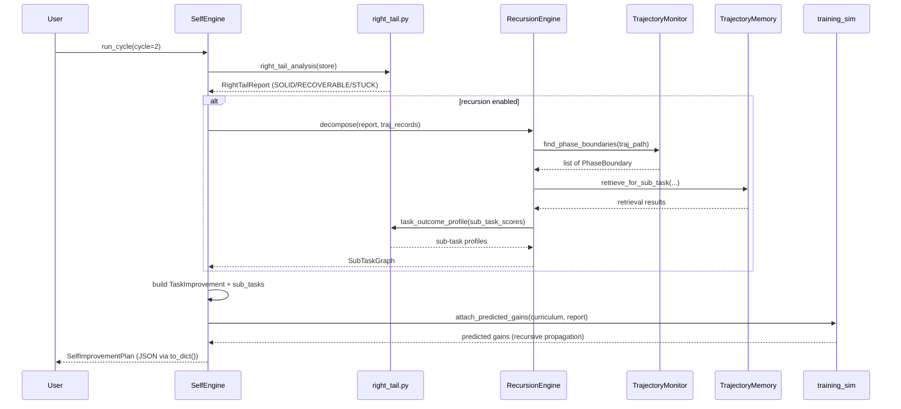

# Phase 2C — Integration Design: `RecursionEngine` in disteval

**Date:** 2026-06-23  
**Scope:** Backward-compatible design for adding a `RecursionEngine` to the existing disteval self-improvement loop.  
**Inputs:**
- `.devin/skills/research-recursive-self-improvement/SKILL.md`
- `research/phase1_master_report.md`
- `research/phase1b_disteval_mapping.md`
- `research/phase1c_integration_questions.md`
- `disteval/self_engine.py`
- `disteval/right_tail.py`
- `disteval/trajectory_monitor.py`
- `disteval/trajectory_memory.py`
- `disteval/training_sim.py`
- `disteval/__main__.py`
- `CURRICULUM_FORMAT.md`

**Constraint:** This is a design document only. No existing disteval code is modified.

---

## 1. Existing files that need changes

The changes are additive and default-disabled so existing users of `disteval engine` are unaffected. All line-number ranges are taken from the current codebase.

### 1.1 `disteval/self_engine.py`

| Line range | Current code | Required change |
|---|---|---|
| `69–79` | `TrainingPair` dataclass | Add recursion-context fields: `parent_task`, `entry_step`, `exit_step`, `sub_task_depth`, `call_stack`. Existing fields remain unchanged. |
| `81–100` | `TaskImprovement` dataclass | Add a `sub_tasks: list[SubTaskImprovement]` field (default empty). This is how a decomposed task carries its sub-task curriculum. |
| `103–134` | `SelfImprovementPlan` dataclass | Add optional `recursion_context: Optional[dict]` and `sub_task_graph: Optional[dict]` for cross-cycle persistence. |
| `169–213` | `SelfImprovementPlan.to_dict()` | Serialize the new `sub_tasks`, `recursion_context`, and augmented `training_pairs` fields. Existing keys must keep their current names and types. |
| `252–310` | `SelfEngine.__init__()` | Accept an optional `recursion_engine: Optional[RecursionEngine]` parameter. If `None`, behavior is exactly the current behavior. |
| `311–361` | `SelfEngine.from_job_dirs()` | Forward the optional `recursion_engine` / `enable_recursion` flag to the constructor. |
| `375–435` | `SelfEngine.run_cycle()` | After `right_tail_analysis()` (around line 394), optionally call `RecursionEngine.decompose()` for STUCK tasks and merge the resulting sub-task items into the curriculum. See Section 4 for the exact flow. |
| `439–468` | `_build_task_improvement()` | If a `TaskOutcomeProfile` has `sub_task_profiles`, build a `SubTaskImprovement` for each child and attach them to the parent `TaskImprovement`. |
| `505–551` | `_build_training_pairs()` | Use the new `entry_step` / `exit_step` boundaries (when provided) to slice trajectories into sub-task reinforce/contrast pairs. |
| `553–575` | `_find_divergence_step()` | Add an overload `_find_divergence_step(high_path, low_path, entry_step, exit_step)` that restricts the monitor search to a sub-task window. |
| `639–677` | `_generate_recommendation()` | Include sub-task decomposition notes in the human-readable recommendation string. |

### 1.2 `disteval/right_tail.py`

| Line range | Current code | Required change |
|---|---|---|
| `115–133` | `TaskOutcomeProfile` | Add `parent_task: Optional[str] = None`, `sub_task_depth: int = 0`, `sub_task_profiles: list[TaskOutcomeProfile] = field(default_factory=list)`, and `recursive_gap: float = 0.0`. A sub-task profile is the same dataclass reused recursively, so nesting is natural. |
| `135–159` | `RightTailReport` | Add `sub_task_profiles: dict[str, list[TaskOutcomeProfile]] = field(default_factory=dict)` mapping each parent task to its decomposed sub-tasks. |
| `163–204` | `task_outcome_profile()` | Add optional `sub_task_scores: Optional[dict[str, list[float]]] = None`. When provided, build `sub_task_profiles` recursively. |
| `207–263` | `right_tail_analysis()` | Accept an optional `task_hierarchy: Optional[dict[str, list[str]]] = None`. If a hierarchy is supplied, compute sub-task profiles from grouped scores and aggregate `recursive_gap` per parent. |

### 1.3 `disteval/trajectory_monitor.py`

| Line range | Current code | Required change |
|---|---|---|
| `43–60` | `TrajectoryFeatures` | Add optional `phase_tag: Optional[str] = None` and `sub_task_id: Optional[str] = None`. These are only used when a decomposition is known. |
| `62–73` | `TrajectoryRecord` | Add optional `entry_step: int = 0` and `exit_step: int = -1` to mark the sub-task window within the full trajectory. |
| `75–87` | `PatternMatch` | Add `entry_step: int = 0`, `exit_step: Optional[int] = None`, and `phase_tag: Optional[str] = None`. |
| `456–486` | `_warning_recommendation()` | Optionally include the phase tag in warnings. |
| `488–524` | `TrajectoryMonitor.check()` | Populate `entry_step` / `exit_step` / `phase_tag` when a decomposition context is provided. |
| `526–536` | `load_trajectory_steps()` / `check_at_step()` | Add a new method `find_phase_boundaries(traj_path: str, min_confidence: float = 0.7) -> list[PhaseBoundary]` after line 536. `PhaseBoundary` is a new dataclass: `{step_index, tool_name, p_high_before, p_high_after, phase_tag}`. |

### 1.4 `disteval/trajectory_memory.py`

| Line range | Current code | Required change |
|---|---|---|
| `36–50` | `TrajectoryRecord` | Add optional `sub_task_slices: list[tuple[int, int, str]] = field(default_factory=list)` describing the `(entry_step, exit_step, sub_task_id)` windows found in the trajectory. |
| `52–61` | `MemoryEntry` | Add `sub_entries: list[SubMemoryEntry]` where each sub-entry stores a sliced trajectory embedding and its own outcome class. |
| `145–160` | `_convert_record()` | If the raw record has decomposition metadata, build `sub_task_slices`. |
| `214–288` | `retrieve()` | Add a `sub_task_id: Optional[str] = None` filter. When set, compare against the sub-entry embeddings rather than the whole-trajectory embedding. |
| `290–305` | `retrieve_for_new_task()` | Keep current behavior unchanged; add a companion `retrieve_for_sub_task(sub_task_id, entry_tool_sequence, k=3)` method after line 305. |

### 1.5 `disteval/training_sim.py`

| Line range | Current code | Required change |
|---|---|---|
| `80–128` | `AgentResult` dataclass | Add `sub_task_gains: Optional[dict] = None` and `sub_task_rounds: Optional[dict] = None` to store recursive simulation results. |
| `199–295` | `apply_training_effect()` | If a task has `sub_task_profiles`, compute per-sub-task improvements and propagate them to the parent task score using the weighted-sum rule from Section 3. Otherwise keep the current flat formula. |
| `339–349` | `_fast_task_kind()` | No change needed; reused for sub-task score arrays. |
| `351–396` | `_fast_apply_improvement()` | Add `sub_task_weights: Optional[dict[str, dict[str, float]]] = None`. When a parent task has decomposed sub-tasks, `parent_imp = Σ_i w_i * sub_imp_i`. |
| `399–521` | `simulate_rounds_to_threshold()` | Use the recursive improvement rule when decomposed tasks exist. |
| `612–680` | `_fast_one_round()` | Same recursive improvement propagation. |
| `808–871` | `analyze_agent()` | Forward the sub-task decomposition graph to the simulation functions. |
| `987–1058` | `build_json_output()` | Include `sub_task_gains` and `sub_task_rounds` in each agent’s JSON output. |

### 1.6 `disteval/__main__.py`

| Line range | Current code | Required change |
|---|---|---|
| `170–256` | `handle_engine()` | Add an optional `--enable-recursion / --no-recursion` flag (default `False`). When enabled, instantiate a `RecursionEngine` and pass it to `SelfEngine.from_job_dirs()`. If disabled, the CLI path is identical to today. |
| `207–212` | `parser.add_argument("--cycle", ...)` | Add the new recursion flag next to the existing `--cycle` argument. |

### 1.7 `CURRICULUM_FORMAT.md`

| Section | Required change |
|---|---|
| Top-level fields | Add optional `sub_task_graph` and `recursion_context` objects. |
| Curriculum item | Add `sub_tasks`, `parent_task`, `entry_step`, `exit_step`, `sub_task_depth`, and `call_stack`. |
| Training pair | Add `parent_task`, `entry_step`, `exit_step`, `sub_task_depth`, and `call_stack`. |
| New section | Add a **Decomposed / sub-task curriculum item** section with a full JSON example. |

---

## 2. Proposed new files

### 2.1 `disteval/recursion_engine.py` (new)

This is the main new module. It is a standalone, pure-Python/numpy dependency-free (except existing imports) class that sits alongside `SelfEngine`.

**Responsibilities:**

1. **Decompose STUCK tasks.** After the flat `right_tail_analysis` identifies tasks with `Q*(t) = 0`, it inspects whether any partial-credit trajectories exist and uses `TrajectoryMonitor.find_phase_boundaries()` to propose sub-task boundaries.
2. **Define sub-task entry/exit conditions.** For each proposed sub-task it records `entry_step` (the first tool call of the phase) and `exit_step` (the last tool call before the next phase or the terminal reward). It also records the tool-name boundary used as a semantic tag.
3. **Slice parent trajectories.** It produces synthetic sub-task trajectories from the best parent runs using `TrajectoryMonitor.load_trajectory_steps()` and a `(entry_step, exit_step)` slice. This bootstraps training pairs for sub-tasks that have never been run independently.
4. **Re-run right-tail analysis at sub-task level.** It builds synthetic score arrays per sub-task and calls `task_outcome_profile()` / `right_tail_analysis()` recursively, producing `TaskOutcomeProfile` objects with `parent_task` and `sub_task_depth` set.
5. **Enforce termination safety.** It maintains a hard `MAX_DEPTH = 3` (configurable) and refuses to decompose a sub-task whose structural complexity is not strictly lower than its parent.
6. **Build a sub-task graph.** It returns a JSON-serializable graph of parent/sub-task relationships that `SelfEngine` attaches to the `SelfImprovementPlan`.

**Public API (proposed):**

```python
from __future__ import annotations
from dataclasses import dataclass, field
from typing import Optional
from .right_tail import RightTailReport, TaskOutcomeProfile, right_tail_analysis
from .trajectory_monitor import TrajectoryMonitor
from .trajectory_memory import TrajectoryMemory


@dataclass
class SubTaskDefinition:
    sub_task_id: str                 # e.g. "medium-2::phase-2"
    parent_task: str
    sub_task_depth: int
    entry_step: int                  # first tool call index inside parent
    exit_step: int                   # last tool call index inside parent
    phase_tag: str                   # e.g. "implement" or "verify"
    instruction: str                 # derived from parent task + phase tag
    estimated_q_star: float          # best observed partial score in this window
    estimated_q_bar: float           # mean observed partial score
    kind: str                        # "solid" | "recoverable" | "stuck"


@dataclass
class SubTaskGraph:
    parent_tasks: list[str]
    sub_tasks: list[SubTaskDefinition]
    edges: list[tuple[str, str]]     # (parent, child) pairs
    profiles: dict[str, TaskOutcomeProfile]  # sub_task_id -> profile


class RecursionEngine:
    MAX_DEPTH: int = 3

    def __init__(
        self,
        monitor: TrajectoryMonitor,
        memory: Optional[TrajectoryMemory] = None,
        max_depth: int = 3,
        min_confidence: float = 0.7,
    ) -> None:
        self.monitor = monitor
        self.memory = memory
        self.max_depth = max_depth
        self.min_confidence = min_confidence

    def decompose(
        self,
        report: RightTailReport,
        traj_records: list,
    ) -> SubTaskGraph:
        """
        Build a sub-task graph from the STUCK/partial tasks in `report`.
        Returns a SubTaskGraph; does not mutate `report`.
        """
        ...

    def _decompose_task(
        self,
        profile: TaskOutcomeProfile,
        records: list,
        depth: int,
    ) -> list[SubTaskDefinition]:
        """Decompose one task into 1-exit sub-tasks."""
        ...

    def _slice_trajectory(
        self,
        traj_path: str,
        entry_step: int,
        exit_step: int,
    ) -> dict:
        """Return a synthetic trajectory dict for the sub-task window."""
        ...
```

### 2.2 `tests/test_recursion_engine.py` (new, optional)

Unit tests for `RecursionEngine` using the existing `medium-2` trajectory fixtures. Validates depth cap, monotone-complexity check, and that decomposed sub-tasks serialize correctly.

---

## 3. Extending the curriculum JSON format

The `CURRICULUM_FORMAT.md` output must remain valid for existing consumers. All new fields are **optional**. Existing top-level fields and curriculum-item fields keep their current names and semantics.

### 3.1 New top-level fields

```json
{
  "agent_name": "Codex CLI",
  "model_name": "openai/o4-mini",
  "cycle": 2,
  "n_tasks_total": 6,
  "n_solid": 2,
  "n_recoverable": 2,
  "n_stuck": 1,
  "n_decomposed": 1,
  "consistency_index": 0.808,
  "recoverable_score_left": 0.833,
  "predicted_total_gain": 0.117,
  "cycle_complete": false,
  "n_trajectories_loaded": 14,
  "recursion_context": {
    "enabled": true,
    "max_depth": 3,
    "depth_reached": 2,
    "terminated_early": []
  },
  "sub_task_graph": {
    "parents": ["disteval/medium-rest-client"],
    "edges": [
      ["disteval/medium-rest-client", "medium-rest-client::phase-2"]
    ]
  },
  "curriculum": [ ... ]
}
```

### 3.2 New per-curriculum-item fields

```json
{
  "task": "disteval/medium-rest-client",
  "difficulty": "medium",
  "kind": "decomposed",
  "parent_task": null,
  "sub_task_depth": 0,
  "entry_step": 0,
  "exit_step": -1,
  "call_stack": [],
  "current_q_star": 1.0,
  "current_q_bar": 0.333,
  "consistency": 0.333,
  "gap": 0.667,
  "priority_score": 0.111,
  "predicted_gain": 0.039,
  "predicted_gain_ci": [0.0, 0.089],
  "predicted_rounds_to_threshold": 28.0,
  "recommendation": "Decomposed into 3 sub-tasks. Train on phase-2 (groupby) first.",
  "n_training_pairs": 1,
  "training_pairs": [ ... ],
  "sub_tasks": [
    {
      "task": "medium-rest-client::phase-2",
      "kind": "recoverable",
      "parent_task": "disteval/medium-rest-client",
      "sub_task_depth": 1,
      "entry_step": 4,
      "exit_step": 12,
      "call_stack": [
        ["disteval/medium-rest-client", "medium-rest-client::phase-2"]
      ],
      "current_q_star": 0.25,
      "current_q_bar": 0.05,
      "consistency": 0.2,
      "gap": 0.20,
      "priority_score": 0.064,
      "n_training_pairs": 1,
      "training_pairs": [
        {
          "reinforce_traj_path": "jobs/run_C/.../medium-2__abc/agent/trajectory.json",
          "contrast_traj_path": "jobs/run_C/.../medium-2__def/agent/trajectory.json",
          "reinforce_score": 0.25,
          "contrast_score": 0.0,
          "gap": 0.25,
          "structural_divergence_step": 2,
          "parent_task": "disteval/medium-rest-client",
          "entry_step": 4,
          "exit_step": 12,
          "sub_task_depth": 1,
          "call_stack": [
            ["disteval/medium-rest-client", "medium-rest-client::phase-2"]
          ]
        }
      ]
    }
  ]
}
```

### 3.3 Field semantics

| Field | Type | Meaning |
|---|---|---|
| `sub_task_graph` | object | Minimal parent/child edges so a downstream trainer can reconstruct the RMDP hierarchy. |
| `recursion_context` | object | Engine settings and termination audit (depth cap, depth reached, early-terminated tasks). |
| `sub_tasks` | array | One `SubTaskImprovement` per decomposed sub-task. Empty for non-decomposed tasks. |
| `parent_task` | string\|null | The task that spawned this sub-task; `null` for top-level tasks. |
| `entry_step` | int | Tool-call index (0-based) where the sub-task begins inside the parent trajectory. |
| `exit_step` | int | Tool-call index (inclusive or exclusive, documented explicitly) where the sub-task ends. `-1` means the end of the parent trajectory. |
| `sub_task_depth` | int | Distance from the original top-level task (`0` = original task). |
| `call_stack` | array of `[parent, child]` pairs | Flat stack representation consistent with the Phase 1 recommendation; JSON-serializable and auditable. |

---

## 4. How `SelfEngine.run_cycle()` calls `RecursionEngine`

The integration is a single new branch inside the existing cycle. The current 6-step flow is preserved when recursion is disabled.

### 4.1 Pseudocode of the modified `run_cycle()`

```python
def run_cycle(self, cycle: Optional[int] = None) -> SelfImprovementPlan:
    if cycle is None:
        cycle = self._cycle
        self._cycle += 1

    # ── STEP 1: OBSERVE (unchanged) ───────────────────────────────────────
    report = right_tail_analysis(self.store, model_name=None)
    kappa = report.sum_q_bar / report.sum_q_star if report.sum_q_star > 0 else 1.0

    # ── NEW: RECURSIVE DECOMPOSITION (default-disabled) ───────────────────
    sub_task_graph = None
    recursion_context = {"enabled": False}
    if self._recursion_engine is not None:
        graph = self._recursion_engine.decompose(report, self._traj_records)
        sub_task_graph = graph.to_dict()
        recursion_context = {
            "enabled": True,
            "max_depth": self._recursion_engine.max_depth,
            "depth_reached": graph.depth_reached,
            "terminated_early": graph.terminated_early,
        }
        # Merge synthetic sub-task profiles into the report so the curriculum
        # builder can treat them like ordinary RECOVERABLE tasks.
        report = self._merge_sub_task_profiles(report, graph)

    # ── STEP 2–4: Build curriculum (mostly unchanged) ─────────────────────
    curriculum = []
    for profile in report.priority_tasks:
        task_item = self._build_task_improvement(profile)
        curriculum.append(task_item)

    curriculum.sort(key=lambda x: x.priority_score, reverse=True)

    # ── STEP 5: SIMULATE (optional, now aware of recursion) ─────────────────
    self._attach_predicted_gains(curriculum, report)

    # ── STEP 6: OUTPUT (extended) ────────────────────────────────────────
    plan = SelfImprovementPlan(
        agent_name=self.agent_name,
        model_name=self.model_name,
        cycle=cycle,
        n_tasks_total=report.n_tasks,
        n_solid=report.n_solid,
        n_recoverable=report.n_recoverable,
        n_stuck=report.n_stuck,
        consistency_index=kappa,
        recoverable_score_left=report.recoverable_score_left,
        curriculum=curriculum,
        predicted_total_gain=predicted_total,
        cycle_complete=(report.n_recoverable == 0 and not sub_task_graph),
        job_dirs=self.job_dirs,
        n_trajectories_loaded=len(self._traj_records),
        recursion_context=recursion_context,
        sub_task_graph=sub_task_graph,
    )
    return plan
```

### 4.2 How `SelfImprovementPlan` changes

- **New dataclass fields:** `recursion_context` and `sub_task_graph`.
- **New per-item fields:** `TaskImprovement.sub_tasks` and augmented `TrainingPair` fields.
- **New curriculum items:** STUCK tasks that were decomposed into RECOVERABLE sub-tasks appear as `kind="decomposed"` entries. Their `sub_tasks` list contains the actual training targets.
- **`cycle_complete` semantics:** When recursion is enabled, `cycle_complete` is `True` only when there are no RECOVERABLE tasks **and** no decomposed sub-tasks remaining. This prevents the engine from declaring victory while sub-tasks still need training.

---

## 5. Extending `TrajectoryMonitor`, `TrajectoryMemory`, and `training_sim`

### 5.1 `TrajectoryMonitor`

The monitor already predicts high/low outcome from structural prefixes. The extension turns those prefixes into explicit RMDP entry/exit boundaries.

- **New dataclass `PhaseBoundary`** (after `PatternMatch`) with fields `{step_index, tool_name, p_high_before, p_high_after, phase_tag}`.
- **New method `find_phase_boundaries(traj_path, min_confidence=0.7)`** that walks the trajectory and returns the step indices where the monitor’s confidence crosses the 0.5 threshold or where a major tool category changes (e.g., first `write_file` after a sequence of `read_file`).
- **Update `PatternMatch`** to carry the `entry_step` / `exit_step` of the sub-task it was called for, so the `RecursionEngine` can map a divergence to a window.

### 5.2 `TrajectoryMemory`

The memory already indexes whole trajectories by tool-frequency embeddings. The extension indexes sub-trajectory slices.

- **New dataclass `SubMemoryEntry`** embedding a slice `[entry_step:exit_step]`.
- **New field `MemoryEntry.sub_entries`**.
- **New method `retrieve_for_sub_task(sub_task_id, entry_tool_sequence, k=3)`** compares the query against `SubMemoryEntry` embeddings, falling back to whole-task memory when no sub-entries exist.
- This lets the `RecursionEngine` bootstrap a new sub-task by retrieving the best demonstration of a matching structural phase from past tasks, satisfying the RMDP “call-stack value backup” intuition.

### 5.3 `training_sim`

The simulator currently applies a flat improvement to each task. The extension propagates improvement from sub-tasks to parents.

- **Weighted-sum rule:** If a parent task `T` is decomposed into sub-tasks `{t_i}` with weights `{w_i}` (e.g., derived from checkpoint scores or equal by default), then:

  ```
  gain(T) = Σ_i w_i * gain(t_i)
  ```

- **Sub-task gains:** Each `t_i` is improved using the existing DPO-style formula (`alpha * DPO_BONUS * q_star * (1 - q_bar)` when paired reinforce/contrast trajectories exist).
- **Aggregation:** The simulator’s `_fast_apply_improvement()` receives a `sub_task_weights` dict and, for any parent task that appears in it, replaces the flat improvement with the weighted sum of its children.
- **Output:** `AgentResult` and `build_json_output()` gain `sub_task_gains` and `sub_task_rounds` so the simulation JSON reflects where the predicted improvement comes from.

---

## 6. Sequence diagram of one full cycle

```text
EVAL ──→ TAXONOMY ──→ DECOMPOSITION ──→ SUB-TASK ANALYSIS ──→ CURRICULUM OUTPUT

1. EVAL: Harbor runs the agent on the benchmark suite and writes
         trajectory.json + score records into each job directory.

2. TAXONOMY: SelfEngine.run_cycle() calls right_tail_analysis(store)
             → TaskOutcomeProfile per task
             → SOLID / RECOVERABLE / STUCK classification.

3. DECOMPOSITION: If recursion is enabled, RecursionEngine.decompose(report)
                  scans STUCK/partial tasks and asks TrajectoryMonitor to
                  find_phase_boundaries() for the best parent trajectory.
                  → Produces SubTaskDefinition list with entry/exit steps.

4. SUB-TASK ANALYSIS: RecursionEngine slices parent trajectories into
                     sub-task windows and re-runs task_outcome_profile()
                     on each window.
                     → Sub-task profiles are attached to parent profiles.
                     → TrajectoryMemory.retrieve_for_sub_task() provides
                       bootstrapped reinforce/contrast demonstrations.

5. CURRICULUM OUTPUT: SelfEngine ranks parent tasks and sub-tasks together
                     by priority_score, attaches predicted gains from
                     training_sim (now aware of recursion), and returns a
                     SelfImprovementPlan with augmented fields.
```

### Mermaid sequence diagram



---

## 7. Backward compatibility

The following guarantees hold for existing users of `disteval engine`:

1. **Default behavior unchanged.** `RecursionEngine` is only used when explicitly passed to `SelfEngine` or when `--enable-recursion` is passed on the CLI. The default `run_cycle()` path is identical to the current implementation.
2. **Existing JSON keys unchanged.** All fields currently documented in `CURRICULUM_FORMAT.md` keep their names, types, and positions. New fields are added only as optional keys.
3. **Existing DPO trainer unaffected.** The `training_pairs` array still contains the same five required keys; downstream code that ignores extra keys continues to work.
4. **`run_cycle()` signature compatible.** The new `recursion_engine` parameter is optional; existing code that constructs `SelfEngine(...)` without it is unaffected.
5. **`right_tail_analysis()` signature compatible.** The new `task_hierarchy` parameter is optional; existing callers are unaffected.
6. **`TrajectoryMonitor.check()` output compatible.** The new fields on `PatternMatch` have safe defaults; existing callers that access `prediction`, `confidence`, `warning`, etc. are unaffected.
7. **`TrajectoryMemory` compatible.** The new `sub_entries` and `retrieve_for_sub_task()` are additive; existing `retrieve_for_new_task()` behavior is unchanged.
8. **`training_sim` compatible.** The new sub-task parameters are optional; the default Monte Carlo loop produces the same numbers as today when no decomposition is supplied.

---

## 8. Open questions for Phase 3

Phase 3 (RL environment generation) must answer the following before implementation begins:

1. **Environment schema.** What JSON schema represents the generated RL environment for a sub-task (states, actions, rewards, transitions)? Should it extend `CURRICULUM_FORMAT.md` or be a separate `ENVIRONMENT_FORMAT.md`?
2. **Sub-task runner integration.** How does a decomposed sub-task become an independently runnable Harbor task? Can the existing `tasks/` directory structure be reused, or do we need a generated `sub_tasks/` directory with synthetic `task.toml` and `test.sh` files?
3. **Boundary validation.** The divergence step is a symptom, not a guaranteed semantic boundary. How do we validate that a proposed `(entry_step, exit_step)` window actually corresponds to a solvable sub-problem? Can the test harness expose per-checkpoint scores to ground the decomposition?
4. **Weight estimation.** How are the sub-task weights `w_i` for parent-score aggregation determined? Options include equal weights, test-checkpoint weights, or learned weights from observed correlations. Which is most reliable and least biased?
5. **Multi-exit vs. 1-exit.** Many disteval tasks are multi-checkpoint (e.g., `medium-2`). The Phase 1 report recommends decomposing them into chains of 1-exit sub-RMDPs. How do we decide the ordering of the chain, and how do we handle branching (parallel sub-tasks)?
6. **Cross-agent sharing.** If one agent is SOLID on a sub-task, can its trajectories serve as reinforce targets for another agent on the same sub-task? This requires a shared sub-task identity and registry.
7. **Cycle-to-cycle persistence.** Should sub-task identity be persisted in the curriculum JSON (`sub_task_graph`), a separate `sub_task_registry.jsonl`, or both? How do we ensure that the same sub-task in cycle `n+1` accumulates scores from cycle `n` rather than being treated as a new task?
8. **Training pair validity.** Parent-trajectory slices may lack the full context of the parent task. How do we inject the correct entry state (file contents, environment) into a sliced trajectory so that it is a valid DPO example?
9. **Convergence under recursion.** Does the recursive right-tail objective remain stable? Empirical calibration of the effective `alpha` and `DPO_BONUS` at sub-task depth > 0 is needed.
10. **No new dependencies.** The SKILL.md constraint is to keep the implementation within the existing Python 3.10 + numpy/pandas/scipy/matplotlib stack. Does Phase 3 require any additional libraries for environment generation or model-based decomposition?

---

## Appendix: File/line quick-reference

- `disteval/self_engine.py`: `TrainingPair` (69–79), `TaskImprovement` (81–100), `SelfImprovementPlan` (103–134), `to_dict()` (169–213), `run_cycle()` (375–435), `_build_task_improvement()` (439–468), `_build_training_pairs()` (505–551), `_find_divergence_step()` (553–575), `_generate_recommendation()` (639–677).
- `disteval/right_tail.py`: `TaskOutcomeProfile` (115–133), `RightTailReport` (135–159), `task_outcome_profile()` (163–204), `right_tail_analysis()` (207–263).
- `disteval/trajectory_monitor.py`: `TrajectoryFeatures` (43–60), `TrajectoryRecord` (62–73), `PatternMatch` (75–87), `check()` (488–524), `load_trajectory_steps()` (526–530).
- `disteval/trajectory_memory.py`: `TrajectoryRecord` (36–50), `MemoryEntry` (52–61), `retrieve()` (214–288), `retrieve_for_new_task()` (290–305).
- `disteval/training_sim.py`: `AgentResult` (80–128), `apply_training_effect()` (199–295), `_fast_apply_improvement()` (351–396), `_fast_one_round()` (612–680), `analyze_agent()` (808–871), `build_json_output()` (987–1058).
- `disteval/__main__.py`: `handle_engine()` (170–256), `--cycle` argument (207–212).
- `CURRICULUM_FORMAT.md`: full document, especially top-level fields, curriculum item, and training pair sections.
